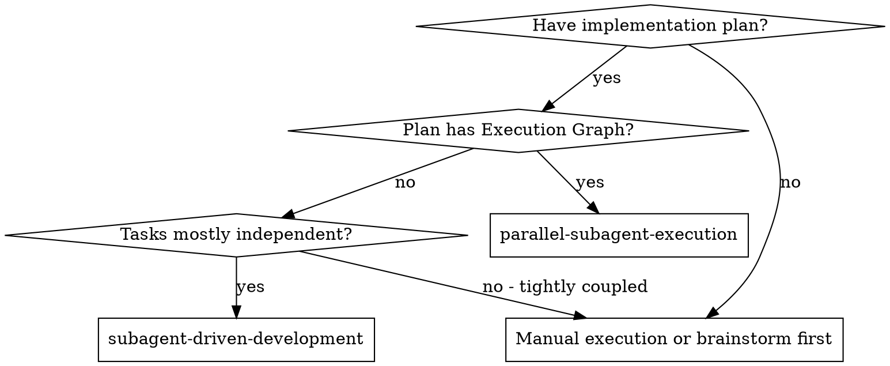

# Parallel Subagent Execution Implementation Plan

> **For agentic workers:** REQUIRED SUB-SKILL: Use `superpowers:subagent-driven-development` to implement this plan task-by-task. (Once `parallel-subagent-execution` exists, it can be used for future plans with an Execution Graph.) Steps use checkbox (`- [ ]`) syntax for tracking.

**Goal:** Add DAG-aware parallel implementation to superpowers: a new `parallel-subagent-execution` skill that dispatches worktree-isolated agents concurrently per Execution Graph layer, merges as complete, and resolves conflicts via a specialist agent.

**Architecture:** Three existing skills are modified (writing-plans gains an Execution Graph section, subagent-driven-development gains routing logic, executing-plans is deprecated, brainstorming gains independence analysis). One new skill directory is created with five files: SKILL.md plus four prompt templates (implementer, spec-reviewer, code-quality-reviewer, conflict-resolver).

**Tech Stack:** Markdown skill files, git worktrees, Claude Code Agent tool for subagent dispatch.

---

## File Structure

**Modified:**
- `skills/writing-plans/SKILL.md` — add Execution Graph section, update plan header and execution handoff
- `skills/subagent-driven-development/SKILL.md` — update routing, remove parallel-dispatch red flag
- `skills/executing-plans/SKILL.md` — add deprecation notice
- `skills/brainstorming/SKILL.md` — add independence analysis to design presentation
- `skills/brainstorming/spec-document-reviewer-prompt.md` — add independence/integration-point checks

**Created:**
- `skills/parallel-subagent-execution/SKILL.md` — main skill: DAG traversal, per-layer dispatch, merge-as-complete
- `skills/parallel-subagent-execution/implementer-prompt.md` — tier-aware implementer with rich commit message
- `skills/parallel-subagent-execution/spec-reviewer-prompt.md` — spec reviewer that reads git log for rationale
- `skills/parallel-subagent-execution/code-quality-reviewer-prompt.md` — quality reviewer with rationale context
- `skills/parallel-subagent-execution/conflict-resolver-prompt.md` — conflict resolution agent

---

## Execution Graph

### Task: writing-plans-update
- **Depends on**: none
- **Parallel group**: A
- **Detail tier**: acceptance-criteria
- **Acceptance criteria**: `skills/writing-plans/SKILL.md` contains: (1) an Execution Graph section defining the three detail tiers and task metadata format, (2) an updated plan header referencing both execution skills with routing logic, (3) an updated Execution Handoff section that removes the `executing-plans` option and routes by Execution Graph presence, (4) guidance that plan prescriptiveness scales to detail tier.

### Task: executing-plans-deprecation
- **Depends on**: none
- **Parallel group**: A
- **Detail tier**: acceptance-criteria
- **Acceptance criteria**: `skills/executing-plans/SKILL.md` begins with a deprecation notice directing users to `superpowers:subagent-driven-development` or `superpowers:parallel-subagent-execution`. Existing content is preserved below the notice.

### Task: brainstorming-independence-analysis
- **Depends on**: none
- **Parallel group**: A
- **Detail tier**: acceptance-criteria
- **Acceptance criteria**: `skills/brainstorming/SKILL.md` includes an independence analysis step in the design presentation phase that asks: which components are independent, what are the shared integration points. `skills/brainstorming/spec-document-reviewer-prompt.md` checks that independent components are identified and integration points are called out.

### Task: parallel-skill-main
- **Depends on**: none
- **Parallel group**: A
- **Detail tier**: acceptance-criteria
- **Acceptance criteria**: `skills/parallel-subagent-execution/SKILL.md` exists and describes: when to use (plan has Execution Graph), setup steps, per-layer workflow (worktree per task, concurrent dispatch, merge-as-complete), per-task workflow (implementer → spec review → quality review), merge conflict routing to conflict-resolver agent, model selection, red flags, and integration section.

### Task: implementer-prompt
- **Depends on**: parallel-skill-main
- **Parallel group**: B
- **Detail tier**: acceptance-criteria
- **Acceptance criteria**: `skills/parallel-subagent-execution/implementer-prompt.md` contains a prompt template that: (1) varies the detail block by tier (contract / skeleton+intent / acceptance-criteria), (2) explicitly instructs the agent to write a rich commit message explaining what was built, key design choices, and alternatives rejected, (3) preserves the self-review and escalation guidance from `subagent-driven-development/implementer-prompt.md`, (4) references the task's worktree path.

### Task: spec-reviewer-prompt
- **Depends on**: parallel-skill-main
- **Parallel group**: B
- **Detail tier**: acceptance-criteria
- **Acceptance criteria**: `skills/parallel-subagent-execution/spec-reviewer-prompt.md` contains a prompt template that: (1) instructs the reviewer to run `git log -1 --format="%B"` in the task's worktree before reviewing to read the implementer's rationale, (2) preserves the "do not trust the report" and line-by-line code comparison guidance from `subagent-driven-development/spec-reviewer-prompt.md`.

### Task: code-quality-reviewer-prompt
- **Depends on**: parallel-skill-main
- **Parallel group**: B
- **Detail tier**: acceptance-criteria
- **Acceptance criteria**: `skills/parallel-subagent-execution/code-quality-reviewer-prompt.md` contains a prompt template that: (1) instructs the reviewer to read the commit message rationale before evaluating design choices, (2) references the worktree path for the HEAD_SHA, (3) preserves the additional checks from `subagent-driven-development/code-quality-reviewer-prompt.md` (responsibility boundaries, file size, testability).

### Task: conflict-resolver-prompt
- **Depends on**: parallel-skill-main
- **Parallel group**: B
- **Detail tier**: acceptance-criteria
- **Acceptance criteria**: `skills/parallel-subagent-execution/conflict-resolver-prompt.md` contains a prompt template that: (1) instructs the agent to run `git log` on both branches to read both commit messages before resolving, (2) directs the agent to preserve the intent of both implementations where possible, (3) includes escalation path (report BLOCKED if resolution requires a design decision), (4) requires a commit message explaining what conflicted and how it was resolved.

### Task: subagent-driven-routing
- **Depends on**: parallel-skill-main
- **Parallel group**: B
- **Detail tier**: acceptance-criteria
- **Acceptance criteria**: `skills/subagent-driven-development/SKILL.md`: (1) "When to Use" diagram adds a branch routing to `parallel-subagent-execution` when plan has an Execution Graph, (2) the red flag "Dispatch multiple implementation subagents in parallel (conflicts)" is removed and replaced with a note explaining that parallel dispatch is handled by `parallel-subagent-execution` with worktree isolation, (3) the Integration section lists `parallel-subagent-execution` as the alternative for plans with Execution Graphs.

---

## Task 1: Update writing-plans/SKILL.md

**Files:**
- Modify: `skills/writing-plans/SKILL.md`

- [ ] **Step 1: Read the current file**

```bash
cat skills/writing-plans/SKILL.md
```

- [ ] **Step 2: Write the updated file**

Replace the full content of `skills/writing-plans/SKILL.md` with:

```markdown
---
name: writing-plans
description: Use when you have a spec or requirements for a multi-step task, before touching code
---

# Writing Plans

## Overview

Write comprehensive implementation plans assuming the engineer has zero context for our codebase and questionable taste. Document everything they need to know: which files to touch for each task, constraints, testing, docs they might need to check, how to test it. Give them the whole plan as bite-sized tasks. DRY. YAGNI. Frequent commits.

Assume they are a skilled developer, but know almost nothing about our toolset or problem domain. Assume they don't know good test design very well.

**Announce at start:** "I'm using the writing-plans skill to create the implementation plan."

**Context:** This should be run in a dedicated worktree (created by brainstorming skill).

**Save plans to:** `docs/superpowers/plans/YYYY-MM-DD-<feature-name>.md`
- (User preferences for plan location override this default)

## Scope Check

If the spec covers multiple independent subsystems, it should have been broken into sub-project specs during brainstorming. If it wasn't, suggest breaking this into separate plans — one per subsystem. Each plan should produce working, testable software on its own.

## File Structure

Before defining tasks, map out which files will be created or modified and what each one is responsible for. This is where decomposition decisions get locked in.

- Design units with clear boundaries and well-defined interfaces. Each file should have one clear responsibility.
- You reason best about code you can hold in context at once, and your edits are more reliable when files are focused. Prefer smaller, focused files over large ones that do too much.
- Files that change together should live together. Split by responsibility, not by technical layer.
- In existing codebases, follow established patterns. If the codebase uses large files, don't unilaterally restructure - but if a file you're modifying has grown unwieldy, including a split in the plan is reasonable.

This structure informs the task decomposition. Each task should produce self-contained changes that make sense independently.

## Execution Graph

Every plan MUST include an **Execution Graph** section after the File Structure. The Execution Graph defines which tasks can run in parallel and what detail level each implementer receives.

### Parallel Groups

Tasks are assigned to lettered groups (A, B, C…). All tasks in a group are independent and can run concurrently. Group B runs only after all Group A tasks complete and merge. Assign groups based on dependency analysis: if task X must complete before task Y can start, Y goes in a later group.

**Err toward parallelization.** If two tasks touch different files and aren't logically dependent, put them in the same group. Merge conflicts, if they occur, are handled by a conflict-resolution agent — they are not a reason to serialize work.

### Detail Tiers

Each task is assigned a detail tier based on how much structure the implementer needs:

**contract** — Use at integration points shared between parallel agents, or anywhere two agents must implement against a shared interface. Provide explicit types, function signatures, and method names. Two agents implementing against a vague interface will diverge; contracts prevent this.

**skeleton+intent** — Use where meaningful design choices exist. Provide function signatures and a description of the algorithm or invariants. The agent decides the internals.

**acceptance-criteria** — Use for isolated utilities with obvious shape. Provide behavioral spec (inputs, outputs, edge cases, errors). No structure prescribed.

### Task Metadata Format

```markdown
## Execution Graph

### Task: <task-id>
- **Depends on**: <task-id>, ... | none
- **Parallel group**: A | B | C ...
- **Detail tier**: contract | skeleton+intent | acceptance-criteria
- **Contract / Skeleton / Criteria**: <content matching tier — omit if acceptance-criteria only>
- **Acceptance criteria**: <behavioral spec — always present regardless of tier>
```

## Plan Document Header

**Every plan MUST start with this header:**

```markdown
# [Feature Name] Implementation Plan

> **For agentic workers:** REQUIRED SUB-SKILL: Use `superpowers:subagent-driven-development` to execute this plan. (`parallel-subagent-execution` is what this plan builds — it does not exist yet.) Steps use checkbox (`- [ ]`) syntax for tracking.

**Goal:** [One sentence describing what this builds]

**Architecture:** [2-3 sentences about approach]

**Tech Stack:** [Key technologies/libraries]

---
```

## Bite-Sized Task Granularity

**Each step is one action (2-5 minutes):**
- "Write the failing test" - step
- "Run it to make sure it fails" - step
- "Implement the minimal code to make the test pass" - step
- "Run the tests and make sure they pass" - step
- "Commit" - step

## Task Structure

````markdown
### Task N: [Component Name]

**Files:**
- Create: `exact/path/to/file.py`
- Modify: `exact/path/to/existing.py:123-145`
- Test: `tests/exact/path/to/test.py`

- [ ] **Step 1: Write the failing test**

```python
def test_specific_behavior():
    result = function(input)
    assert result == expected
```

- [ ] **Step 2: Run test to verify it fails**

Run: `pytest tests/path/test.py::test_name -v`
Expected: FAIL with "function not defined"

- [ ] **Step 3: Write minimal implementation**

```python
def function(input):
    return expected
```

- [ ] **Step 4: Run test to verify it passes**

Run: `pytest tests/path/test.py::test_name -v`
Expected: PASS

- [ ] **Step 5: Commit**

```bash
git add tests/path/test.py src/path/file.py
git commit -m "feat: add specific feature"
```
````

## No Placeholders

Every step must contain the actual content an engineer needs. These are **plan failures** — never write them:
- "TBD", "TODO", "implement later", "fill in details"
- "Add appropriate error handling" / "add validation" / "handle edge cases"
- "Write tests for the above" (without actual test code)
- "Similar to Task N" (repeat the code — the engineer may be reading tasks out of order)
- Steps that describe what to do without showing how (code blocks required for code steps)
- References to types, functions, or methods not defined in any task

## Remember
- Exact file paths always
- Complete code in every step — if a step changes code, show the code
- Exact commands with expected output
- DRY, YAGNI, frequent commits

## Self-Review

After writing the complete plan, look at the spec with fresh eyes and check the plan against it. This is a checklist you run yourself — not a subagent dispatch.

**1. Spec coverage:** Skim each section/requirement in the spec. Can you point to a task that implements it? List any gaps.

**2. Placeholder scan:** Search your plan for red flags — any of the patterns from the "No Placeholders" section above. Fix them.

**3. Type consistency:** Do the types, method signatures, and property names you used in later tasks match what you defined in earlier tasks? A function called `clearLayers()` in Task 3 but `clearFullLayers()` in Task 7 is a bug.

**4. Execution Graph coverage:** Does every task in the plan appear in the Execution Graph? Does every Execution Graph task have a corresponding plan task?

If you find issues, fix them inline. No need to re-review — just fix and move on.

## Execution Handoff

After saving the plan:

**"Plan complete and saved to `docs/superpowers/plans/<filename>.md`.**

**Execution:** Use `superpowers:parallel-subagent-execution` if this plan has an Execution Graph (recommended for most plans). Use `superpowers:subagent-driven-development` for sequential-only plans."
```

- [ ] **Step 3: Verify the file reads back correctly**

```bash
grep -n "Execution Graph\|Detail Tiers\|parallel-subagent-execution\|Execution Handoff" skills/writing-plans/SKILL.md
```

Expected: Lines for "Execution Graph", "Detail Tiers", "parallel-subagent-execution", "Execution Handoff" all present.

- [ ] **Step 4: Commit**

```bash
git add skills/writing-plans/SKILL.md
git commit -m "feat(writing-plans): add Execution Graph section and parallel execution routing

Adds mandatory Execution Graph section defining parallel groups, dependency
annotations, and three detail tiers (contract, skeleton+intent, acceptance-criteria).
Updates plan header and execution handoff to route to parallel-subagent-execution
when Execution Graph is present. Removes executing-plans from execution options.
Removes TDD mandate from overview — tests are required but timing is left to
implementers."
```

---

## Task 2: Deprecate executing-plans/SKILL.md

**Files:**
- Modify: `skills/executing-plans/SKILL.md`

- [ ] **Step 1: Read the current file**

```bash
cat skills/executing-plans/SKILL.md
```

- [ ] **Step 2: Prepend the deprecation notice**

Add the following block at the very top of the file, before the frontmatter or as the first content after frontmatter:

The file currently starts with:
```
---
name: executing-plans
description: Use when you have a written implementation plan to execute in a separate session with review checkpoints
---

# Executing Plans
```

Replace that opening with:
```
---
name: executing-plans
description: DEPRECATED — use superpowers:subagent-driven-development or superpowers:parallel-subagent-execution instead
---

> **DEPRECATED.** This skill is no longer recommended. Use `superpowers:parallel-subagent-execution` for plans with an Execution Graph, or `superpowers:subagent-driven-development` for sequential plans. Both provide subagent dispatch with review gates, which produces significantly higher quality output than solo execution. The content below is preserved for reference.

# Executing Plans (Deprecated)
```

- [ ] **Step 3: Verify**

```bash
head -10 skills/executing-plans/SKILL.md
```

Expected: Deprecation notice visible in first 10 lines.

- [ ] **Step 4: Commit**

```bash
git add skills/executing-plans/SKILL.md
git commit -m "deprecate(executing-plans): direct users to subagent-driven or parallel-subagent-execution

Plans always dispatch through subagents. Solo execution is no longer recommended."
```

---

## Task 3: Update brainstorming for independence analysis

**Files:**
- Modify: `skills/brainstorming/SKILL.md`
- Modify: `skills/brainstorming/spec-document-reviewer-prompt.md`

- [ ] **Step 1: Read both files**

```bash
cat skills/brainstorming/SKILL.md
cat skills/brainstorming/spec-document-reviewer-prompt.md
```

- [ ] **Step 2: Add independence analysis step to brainstorming SKILL.md**

In the "Presenting the design" section of `skills/brainstorming/SKILL.md`, add after the existing "Design for isolation and clarity" paragraph:

Find this text:
```
**Working in existing codebases:**
```

Insert before it:
```
**Independence analysis:**

Before finishing the design, explicitly identify:
- Which components can be built independently (no shared state, no interface dependency)
- Which components share integration points (types, interfaces, APIs that parallel agents must agree on)

This feeds directly into the implementation plan's Execution Graph. State it clearly in the design: "X and Y are independent — they can be built in parallel. Z depends on the interface defined by X." If everything is sequential, say so and explain why.

```

- [ ] **Step 3: Verify brainstorming SKILL.md change**

```bash
grep -n "Independence analysis\|independent\|integration points" skills/brainstorming/SKILL.md | head -10
```

Expected: Lines containing "Independence analysis" and "integration points" present.

- [ ] **Step 4: Update spec-document-reviewer-prompt.md**

In `skills/brainstorming/spec-document-reviewer-prompt.md`, add a row to the "What to Check" table:

Find:
```
| YAGNI | Unrequested features, over-engineering |
```

Replace with:
```
| YAGNI | Unrequested features, over-engineering |
| Independence | Are independent components identified? Are shared integration points called out? (Required for Execution Graph planning) |
```

- [ ] **Step 5: Verify spec reviewer change**

```bash
grep -n "Independence\|integration points" skills/brainstorming/spec-document-reviewer-prompt.md
```

Expected: Both terms present.

- [ ] **Step 6: Commit**

```bash
git add skills/brainstorming/SKILL.md skills/brainstorming/spec-document-reviewer-prompt.md
git commit -m "feat(brainstorming): add independence analysis to design phase

Specs now explicitly identify independent components and shared integration
points. This feeds directly into Execution Graph planning in writing-plans,
enabling better parallelization decisions downstream."
```

---

## Task 4: Create parallel-subagent-execution/SKILL.md

**Files:**
- Create: `skills/parallel-subagent-execution/SKILL.md`

- [ ] **Step 1: Create the directory and file**

```bash
mkdir -p skills/parallel-subagent-execution
```

Write `skills/parallel-subagent-execution/SKILL.md`:

```markdown
---
name: parallel-subagent-execution
description: Use when executing implementation plans with an Execution Graph — dispatches worktree-isolated agents per parallel group, merges as complete
---

# Parallel Subagent Execution

Execute an implementation plan by traversing its Execution Graph: dispatch all tasks in each parallel group concurrently, each in its own git worktree. Merge branches as they complete. Advance to the next group when all merges are done.

**Announce at start:** "I'm using the parallel-subagent-execution skill to implement this plan."

## When to Use

Use this skill when the implementation plan contains an **Execution Graph** section. If the plan has no Execution Graph, use `superpowers:subagent-driven-development` instead.

## Setup

1. Ensure you are in a git worktree (use `superpowers:using-git-worktrees` if not already set up)
2. Read the plan, extract the Execution Graph
3. Compute topological layer order from dependency and parallel group annotations
4. Create a TodoWrite with all tasks

## Per Layer

For each parallel group (A, B, C… in topological order):

1. For each task in the group, create a git worktree:
   ```bash
   git worktree add .worktrees/<task-id> -b <task-id>
   ```
2. Dispatch all implementer agents for the group **concurrently** (single message, multiple Agent tool calls — see `./implementer-prompt.md`)
3. As each implementer completes, run the two-stage review in that worktree (do not wait for sibling tasks)
4. As each task passes both reviews, merge immediately from your main worktree:
   ```bash
   git merge <task-id>
   ```
5. If merge produces a conflict, dispatch a conflict-resolution agent (see `./conflict-resolver-prompt.md`)
6. Once all tasks in the group are merged, remove worktrees:
   ```bash
   git worktree remove .worktrees/<task-id>
   ```
7. Advance to the next group

## Per Task: Implementer

Dispatch using `./implementer-prompt.md`. Provide:
- Task metadata at the appropriate **detail tier** from the Execution Graph (contract, skeleton+intent, or acceptance-criteria)
- Acceptance criteria (always required)
- Scene-setting context (where this fits, what depends on it)
- The worktree path to work in: `.worktrees/<task-id>`

The implementer produces:
- Implementation satisfying acceptance criteria
- Tests (agent decides when to write them; they must exist and pass before reporting DONE)
- A **rich commit message** explaining what was built, key design choices, and alternatives considered and rejected

## Per Task: Review

Both reviewers work in the task's worktree and read the implementer's commit message via `git log` before reviewing.

**Stage 1 — Spec compliance** (`./spec-reviewer-prompt.md`):
- Did the agent build what was asked, nothing more, nothing less?
- Read actual code; do not trust the implementer's report
- Loop: implementer fixes → reviewer re-reviews → until ✅

**Stage 2 — Code quality** (`./code-quality-reviewer-prompt.md`):
- **Only dispatch after spec compliance passes ✅**
- Tests, maintainability, responsibility boundaries
- Loop: implementer fixes → reviewer re-reviews → until ✅

## Merge-as-Complete

As each task clears both reviews, merge immediately — do not wait for sibling tasks in the same group:

```bash
# From your main worktree (not the task worktree)
git merge <task-id>
```

**If the merge produces a conflict:** dispatch a conflict-resolution agent (`./conflict-resolver-prompt.md`) with both branch names, both commit messages, and the conflict diff. Do not resolve conflicts manually in your context — dispatch the agent.

Once the conflict agent commits a resolution, continue merging remaining branches.

## Model Selection

- **Mechanical tasks** (isolated, clear spec, 1-2 files): fast/cheap model
- **Integration and judgment tasks** (multi-file, pattern matching): standard model
- **Architecture, design, review tasks**: most capable model

## Handling Implementer Status

- **DONE:** Proceed to spec compliance review
- **DONE_WITH_CONCERNS:** Read concerns; address correctness issues before review; proceed if concerns are observations only
- **NEEDS_CONTEXT:** Provide missing context, re-dispatch
- **BLOCKED:** Assess blocker — provide context, upgrade model, break task, or escalate to human

## Red Flags

**Never:**
- Merge a branch before both review stages pass ✅
- Skip the conflict-resolution agent when `git merge` fails — do not resolve conflicts in your own context
- Advance to the next group before all current-group merges complete
- Make implementer subagents read the plan file — provide full task text in the prompt
- Skip scene-setting context
- Start on main/master without a worktree

**If spec compliance review finds issues:** implementer fixes in the worktree, reviewer re-reviews. Do not merge until ✅.

**If code quality review finds issues:** implementer fixes, reviewer re-reviews. Do not merge until ✅.

## Integration

**Required workflow skills:**
- **superpowers:using-git-worktrees** — REQUIRED: Set up isolated workspace before starting
- **superpowers:writing-plans** — Creates plans with Execution Graphs this skill executes
- **superpowers:finishing-a-development-branch** — Complete development after all tasks

**Prompt templates:**
- `./implementer-prompt.md` — Dispatch implementation subagent
- `./spec-reviewer-prompt.md` — Dispatch spec compliance reviewer
- `./code-quality-reviewer-prompt.md` — Dispatch code quality reviewer
- `./conflict-resolver-prompt.md` — Dispatch conflict resolution agent

**Alternative for sequential plans:**
- **superpowers:subagent-driven-development** — Use when plan has no Execution Graph
```

- [ ] **Step 2: Verify the file exists and key sections are present**

```bash
grep -n "Per Layer\|Merge-as-Complete\|conflict-resolver\|Detail tier\|Execution Graph" skills/parallel-subagent-execution/SKILL.md
```

Expected: All five terms found.

- [ ] **Step 3: Commit**

```bash
git add skills/parallel-subagent-execution/SKILL.md
git commit -m "feat(parallel-subagent-execution): add main skill file

Introduces parallel-subagent-execution skill for DAG-based parallel
implementation. Dispatches worktree-isolated agents per group, merges
as complete, routes conflicts to specialist agent."
```

---

## Task 5: Create implementer-prompt.md

**Files:**
- Create: `skills/parallel-subagent-execution/implementer-prompt.md`

- [ ] **Step 1: Write the file**

```markdown
# Implementer Subagent Prompt Template

Use this template when dispatching an implementer subagent for a parallel task.

The `[DETAIL]` block varies by tier — paste the appropriate content from the task's Execution Graph entry.

```
Task tool (general-purpose):
  description: "Implement [task-id]: [task name]"
  prompt: |
    You are implementing task [task-id]: [task name]

    ## Task Specification

    **Detail tier:** [contract | skeleton+intent | acceptance-criteria]

    [Paste ONE of the following blocks based on the task's detail tier:]

    ---
    IF tier = contract:
    **Contract — implement against this interface exactly. Do not change these signatures.**
    [paste contract from Execution Graph]

    **Acceptance criteria:**
    [paste acceptance criteria]
    ---

    ---
    IF tier = skeleton+intent:
    **Skeleton and intent:**
    [paste skeleton from Execution Graph]

    **Acceptance criteria:**
    [paste acceptance criteria]
    ---

    ---
    IF tier = acceptance-criteria:
    **Acceptance criteria:**
    [paste acceptance criteria]
    ---

    ## Context

    [Scene-setting: where this fits in the system, what depends on this task, what this task depends on, any architectural context needed to make good decisions]

    ## Before You Begin

    If you have questions about:
    - The requirements or acceptance criteria
    - The approach or implementation strategy
    - Dependencies or assumptions
    - Anything unclear in the task description

    **Ask them now.** Raise any concerns before starting work.

    ## Your Job

    Once you're clear on requirements:
    1. Implement what the spec requires
    2. Write tests satisfying the acceptance criteria — decide yourself when to write them, but they must exist and pass before you report DONE
    3. Verify all tests pass
    4. Write a **rich commit message** that includes:
       - What you built
       - Key design choices you made (and why)
       - Alternatives you considered and rejected (and why)
       - Anything a reviewer should know to evaluate your approach
    5. Commit
    6. Self-review (see below)
    7. Report back

    Work from: .worktrees/[task-id]

    **While you work:** If you encounter something unexpected or unclear, ask. Don't guess or make assumptions.

    ## Code Organization

    - Follow the file structure defined in the plan
    - Each file should have one clear responsibility with a well-defined interface
    - If a file is growing beyond the plan's intent, stop and report DONE_WITH_CONCERNS — don't split files on your own
    - Follow existing codebase patterns; improve what you touch but don't restructure outside your task

    ## When You're in Over Your Head

    It is always OK to stop and say "this is too hard for me." Bad work is worse than no work.

    **STOP and escalate when:**
    - The task requires architectural decisions with multiple valid approaches
    - You need to understand code beyond what was provided and can't find clarity
    - You feel uncertain about whether your approach is correct
    - You've been reading file after file without progress

    Report back with BLOCKED or NEEDS_CONTEXT. Describe specifically what you're stuck on.

    ## Before Reporting Back: Self-Review

    **Completeness:**
    - Did I fully implement everything in the spec?
    - Do all tests pass?
    - Did I miss any acceptance criteria?

    **Quality:**
    - Is this my best work?
    - Are names clear and accurate?
    - Is the code clean and maintainable?

    **Discipline:**
    - Did I avoid overbuilding (YAGNI)?
    - Did I only build what was requested?
    - Did I follow existing patterns?

    **Commit message:**
    - Does my commit message explain WHY I made each key choice?
    - Would a reviewer understand my intent from reading it?
    - Did I document alternatives I rejected?

    If you find issues during self-review, fix them before reporting.

    ## Report Format

    - **Status:** DONE | DONE_WITH_CONCERNS | BLOCKED | NEEDS_CONTEXT
    - What you implemented (or attempted, if blocked)
    - Test results (N passing)
    - Files changed
    - Commit SHA
    - Self-review findings (if any)
    - Concerns (if DONE_WITH_CONCERNS)
```
```

- [ ] **Step 2: Verify key elements present**

```bash
grep -n "rich commit message\|Detail tier\|contract\|skeleton+intent\|acceptance-criteria\|DONE_WITH_CONCERNS" skills/parallel-subagent-execution/implementer-prompt.md
```

Expected: All six terms found.

- [ ] **Step 3: Commit**

```bash
git add skills/parallel-subagent-execution/implementer-prompt.md
git commit -m "feat(parallel-subagent-execution): add tier-aware implementer prompt

Implementer receives detail at the appropriate tier (contract/skeleton+intent/
acceptance-criteria). Requires a rich commit message explaining design choices
and alternatives — this rationale is read by both reviewers and conflict agents."
```

---

## Task 6: Create spec-reviewer-prompt.md

**Files:**
- Create: `skills/parallel-subagent-execution/spec-reviewer-prompt.md`

- [ ] **Step 1: Write the file**

```markdown
# Spec Compliance Reviewer Prompt Template

Use this template when dispatching a spec compliance reviewer for a parallel task.

**Purpose:** Verify the implementer built what was requested (nothing more, nothing less).

```
Task tool (general-purpose):
  description: "Spec compliance review for [task-id]"
  prompt: |
    You are reviewing whether an implementation matches its specification.

    ## What Was Requested

    [FULL TEXT of task requirements and acceptance criteria from the Execution Graph]

    ## What the Implementer Claims They Built

    [From implementer's report]

    ## Read the Implementer's Rationale First

    Before reviewing code, read the implementer's commit message to understand their
    intent and design choices:

    ```bash
    cd .worktrees/[task-id]
    git log -1 --format="%B"
    ```

    The commit message explains WHY; the code shows WHAT. Use the rationale to
    distinguish deliberate choices from mistakes — but do not let it substitute
    for reading the code.

    ## CRITICAL: Do Not Trust the Report

    The implementer's report may be incomplete, inaccurate, or optimistic.
    You MUST verify everything by reading the actual code.

    **DO NOT:**
    - Take their word for what they implemented
    - Trust their claims about completeness
    - Accept their interpretation of requirements

    **DO:**
    - Read the actual code they wrote
    - Compare implementation to requirements line by line
    - Check for missing requirements
    - Look for extra features not in spec

    ## Your Job

    Working from: .worktrees/[task-id]

    **Missing requirements:** Did they implement everything requested? Are there
    requirements they skipped? Did they claim something works but not implement it?

    **Extra/unneeded work:** Did they build things not in spec? Did they over-engineer?
    Did they add unrequested features?

    **Misunderstandings:** Did they interpret requirements differently than intended?
    Did they solve the wrong problem?

    Verify by reading code, not by trusting the report.

    ## Report

    - ✅ Spec compliant (after code inspection)
    - ❌ Issues found: [list specifically, with file:line references]
```
```

- [ ] **Step 2: Verify**

```bash
grep -n "git log\|rationale\|Do Not Trust" skills/parallel-subagent-execution/spec-reviewer-prompt.md
```

Expected: All three terms found.

- [ ] **Step 3: Commit**

```bash
git add skills/parallel-subagent-execution/spec-reviewer-prompt.md
git commit -m "feat(parallel-subagent-execution): add spec reviewer prompt with rationale reading

Reviewer reads implementer's commit message before reviewing code, using it
to distinguish deliberate choices from mistakes. Core 'do not trust the report'
guidance preserved from subagent-driven-development."
```

---

## Task 7: Create code-quality-reviewer-prompt.md

**Files:**
- Create: `skills/parallel-subagent-execution/code-quality-reviewer-prompt.md`

- [ ] **Step 1: Write the file**

```markdown
# Code Quality Reviewer Prompt Template

Use this template when dispatching a code quality reviewer for a parallel task.

**Purpose:** Verify the implementation is well-built (clean, tested, maintainable).

**Only dispatch after spec compliance review passes ✅**

```
Task tool (superpowers:code-reviewer):
  Use template at requesting-code-review/code-reviewer.md

  WHAT_WAS_IMPLEMENTED: [from implementer's report]
  PLAN_OR_REQUIREMENTS: task [task-id] Execution Graph entry
  BASE_SHA: [commit before task — run `git log --oneline` in worktree to find it]
  HEAD_SHA: [current HEAD in worktree — run `git rev-parse HEAD` in .worktrees/[task-id]]
  DESCRIPTION: [task summary]
  WORKTREE: .worktrees/[task-id]
```

**Before reviewing,** read the implementer's rationale:

```bash
cd .worktrees/[task-id]
git log -1 --format="%B"
```

Use the rationale to evaluate whether design choices are sound, not just whether
the code is syntactically clean. A choice that looks odd may be justified — or
the rationale may reveal a misunderstanding worth flagging.

**Additional checks beyond standard code quality:**
- Does each file have one clear responsibility with a well-defined interface?
- Are units decomposed so they can be understood and tested independently?
- Did this change create new files that are already large, or significantly grow existing files? (Focus on what this change contributed — don't flag pre-existing sizes.)
- Do tests verify behavior, not just mock behavior?

**Returns:** Strengths, Issues (Critical/Important/Minor), Assessment
```

- [ ] **Step 2: Verify**

```bash
grep -n "git log\|rationale\|spec compliance\|WORKTREE" skills/parallel-subagent-execution/code-quality-reviewer-prompt.md
```

Expected: All four terms found.

- [ ] **Step 3: Commit**

```bash
git add skills/parallel-subagent-execution/code-quality-reviewer-prompt.md
git commit -m "feat(parallel-subagent-execution): add code quality reviewer prompt

Quality reviewer reads implementer's commit message rationale before
evaluating design choices. Includes worktree path for HEAD_SHA lookup."
```

---

## Task 8: Create conflict-resolver-prompt.md

**Files:**
- Create: `skills/parallel-subagent-execution/conflict-resolver-prompt.md`

- [ ] **Step 1: Write the file**

```markdown
# Conflict Resolution Agent Prompt Template

Use this template when `git merge` fails during parallel layer execution.

```
Task tool (general-purpose):
  description: "Resolve merge conflict: [branch-a] vs [branch-b]"
  prompt: |
    A merge conflict occurred while integrating two parallel implementation branches.
    Your job is to resolve it correctly, preserving the intent of both implementations.

    ## What Happened

    These two branches were implemented in parallel as independent tasks in the same
    feature. Both implementations are intentional. Resolve the conflict in a way that
    preserves both implementations' intent — prefer merging approaches over discarding
    either side.

    ## Branch A: [branch-a]

    **What it implemented:** [task-a description from Execution Graph]

    Read the implementer's rationale:
    ```bash
    git log [branch-a] -1 --format="%B"
    ```

    ## Branch B: [branch-b]

    **What it implemented:** [task-b description from Execution Graph]

    Read the implementer's rationale:
    ```bash
    git log [branch-b] -1 --format="%B"
    ```

    ## The Conflict

    ```
    [paste full conflict diff — include file paths and all conflict markers]
    ```

    ## Your Job

    1. Read both commit messages to understand the intent behind each conflicting change
    2. Read the conflicting files in full in both branches to understand the full context
    3. Resolve the conflict preserving both implementations' intent where possible
    4. If both implementations made genuinely incompatible architectural choices, prefer
       the approach that better satisfies the overall feature goals — explain why in
       your commit message
    5. Run any available tests to verify the resolution does not break either task's
       acceptance criteria
    6. Commit with a message that explains: what conflicted, why, and how you resolved it

    ## When You Cannot Resolve

    If the conflict requires a design decision beyond your authority:
    - Do NOT guess
    - Report back with status BLOCKED
    - Describe specifically: what conflicted, what each branch intended, why they're
      incompatible, and what decision needs to be made by a human

    ## Report Format

    - **Status:** DONE | BLOCKED
    - What conflicted and why
    - How you resolved it (or what decision is needed, if BLOCKED)
    - Commit SHA of the resolution
```
```

- [ ] **Step 2: Verify**

```bash
grep -n "git log\|BLOCKED\|preserve\|commit message" skills/parallel-subagent-execution/conflict-resolver-prompt.md
```

Expected: All four terms found.

- [ ] **Step 3: Commit**

```bash
git add skills/parallel-subagent-execution/conflict-resolver-prompt.md
git commit -m "feat(parallel-subagent-execution): add conflict resolver prompt

Conflict agent reads both implementers' rationale via git log before resolving.
Escalates with BLOCKED when resolution requires a design decision. Requires
a commit message explaining the conflict and resolution approach."
```

---

## Task 9: Update subagent-driven-development routing

**Files:**
- Modify: `skills/subagent-driven-development/SKILL.md`

- [ ] **Step 1: Read the current file**

```bash
cat skills/subagent-driven-development/SKILL.md
```

- [ ] **Step 2: Update the "When to Use" diagram**

Find the `digraph when_to_use` block. Replace it with:



- [ ] **Step 3: Update the Red Flags section**

Find:
```
- Dispatch multiple implementation subagents in parallel (conflicts)
```

Replace with:
```
- Dispatch multiple implementation subagents in parallel without worktree isolation — use `superpowers:parallel-subagent-execution` for parallel dispatch
```

- [ ] **Step 4: Update the Integration section**

Find the `**Alternative workflow:**` block at the bottom:
```
**Alternative workflow:**
- **superpowers:executing-plans** - Use for parallel session instead of same-session execution
```

Replace with:
```
**Alternative workflows:**
- **superpowers:parallel-subagent-execution** - Use when plan has an Execution Graph (parallel dispatch with worktree isolation)
```

- [ ] **Step 5: Verify changes**

```bash
grep -n "Execution Graph\|parallel-subagent-execution\|worktree isolation" skills/subagent-driven-development/SKILL.md
```

Expected: All three terms found.

- [ ] **Step 6: Commit**

```bash
git add skills/subagent-driven-development/SKILL.md
git commit -m "feat(subagent-driven-development): add routing to parallel-subagent-execution

When to Use diagram now routes to parallel-subagent-execution for plans with
an Execution Graph. Parallel dispatch red flag clarified: use the parallel
skill with worktree isolation rather than avoiding parallelism entirely.
executing-plans removed from alternatives."
```

---

## Verification

- [ ] **1. All new files exist**

```bash
ls skills/parallel-subagent-execution/
```

Expected: `SKILL.md  implementer-prompt.md  spec-reviewer-prompt.md  code-quality-reviewer-prompt.md  conflict-resolver-prompt.md`

- [ ] **2. writing-plans routes correctly**

```bash
grep -n "parallel-subagent-execution\|Execution Graph\|executing-plans" skills/writing-plans/SKILL.md
```

Expected: `parallel-subagent-execution` and `Execution Graph` present; `executing-plans` only appears in the context of being removed/not listed.

- [ ] **3. Deprecation notice in executing-plans**

```bash
head -8 skills/executing-plans/SKILL.md
```

Expected: DEPRECATED notice in first 8 lines.

- [ ] **4. subagent-driven-development routes to parallel skill**

```bash
grep -n "parallel-subagent-execution\|Execution Graph" skills/subagent-driven-development/SKILL.md
```

Expected: Both terms present.

- [ ] **5. Brainstorming independence analysis present**

```bash
grep -n "Independence analysis\|integration points" skills/brainstorming/SKILL.md skills/brainstorming/spec-document-reviewer-prompt.md
```

Expected: Both terms in both files.

- [ ] **6. Commit log clean**

```bash
git log --oneline -10
```

Expected: 9 commits from this implementation with conventional commit messages.
